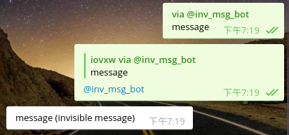

# iugytf

需先在 [@BotFather](https://telegram.me/BotFather) 里将 Bot 的 `/setprivacy` 设置为 `Disable`，
以及 `/setinline`

---------------------------

在输入框内输入 `@BotID message(invisible message)` (需将 BotID 替换为实际 Bot 的 ID)

由 Bot 转换后，将会只显示 `message`。括号内的消息会经过不可见字符的编码，隐藏起来

可以 Reply 带有隐藏消息的消息同时 @BotID，Bot 就会解码隐藏文字

## Run

    $ java -jar frtyyj-0.1.0-standalone.jar [bot-key]

## License

The MIT License (MIT)

Copyright © 2016 iovxw
